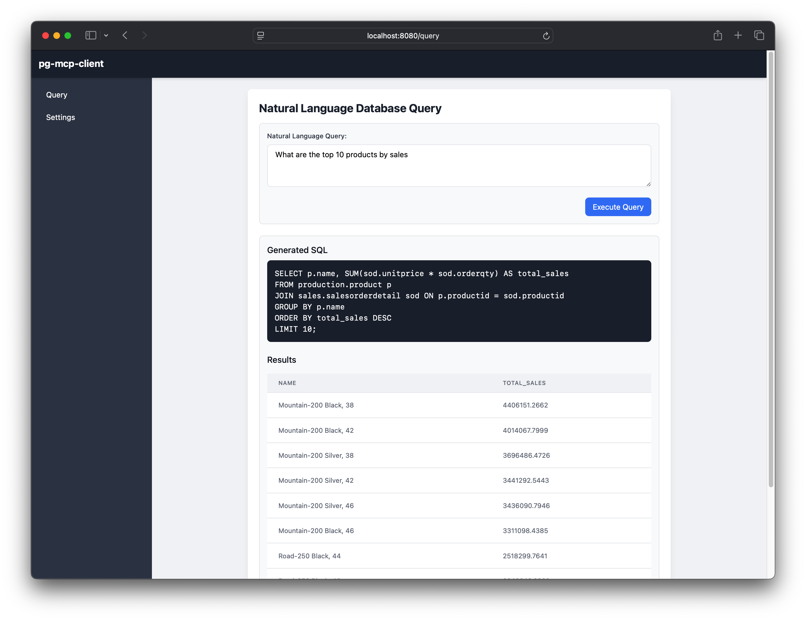

# PG-MCP-Client

A web-based client application for the PostgreSQL Model Context Protocol (PG-MCP) server that allows users to query databases using natural language.  

More info on the pg-mcp project here:
### [https://stuzero.github.io/pg-mcp/](https://stuzero.github.io/pg-mcp/)

## Overview

PG-MCP-Client provides a user-friendly web interface for interacting with PostgreSQL databases through the [PG-MCP server](https://github.com/stuzero/pg-mcp-server). It leverages AI language models to translate natural language questions into SQL queries, making database exploration accessible to users without SQL expertise.

The client connects to a PG-MCP server, which provides database schema information and query execution capabilities, while an AI provider (Anthropic, Google, or OpenAI) handles the natural language understanding and SQL generation.

## Features

- **Natural Language Interface**: Query your PostgreSQL database using plain English
- **Multiple LLM Support**: Compatible with Anthropic (Claude), Google (Gemini), and OpenAI models
- **Interactive UI**: Clean, responsive web interface built with Tailwind CSS and HTMX
- **Database Schema Exploration**: Automatically retrieves and uses database schema for accurate query generation
- **Query Visualization**: Displays generated SQL and query results in a formatted table
- **Configurable Settings**: Easy configuration of API keys and connection details

## Screenshot



## Installation

### Prerequisites

- Python 3.13+
- A running [PG-MCP server](https://github.com/stuzero/pg-mcp)
- API key from one of the supported AI providers:
  - [Anthropic](https://anthropic.com/)
  - [Google AI (Gemini)](https://ai.google.dev/)
  - [OpenAI](https://openai.com/)

### Using Docker

```bash
# Clone the repository
git clone https://github.com/stuzero/pg-mcp-client.git
cd pg-mcp-client

# Create a .env file with your application secret
echo "APPLICATION_SECRET=your_secure_random_string" > .env

# Build and run with Docker
docker-compose up -d
```

### Manual Installation

This project uses `uv` for dependency management:  
[uv Installation Instructions](https://docs.astral.sh/uv/#installation)

```bash
# Clone the repository
git clone https://github.com/stuzero/pg-mcp-client.git
cd pg-mcp-client

# Install dependencies and create a virtual environment ( .venv )
uv sync

# Activate the virtual environment
source .venv/bin/activate

# Create a .env file with your application secret
echo "APPLICATION_SECRET=your_secure_random_string" > .env

# Run the application
python -m client.app
```

## Usage

1. Access the web interface at http://localhost:8080
2. Navigate to the Settings page and configure:
   - LLM Provider (Anthropic, Gemini, or OpenAI)
   - LLM API Key
   - PG-MCP Server URL (e.g., http://localhost:8000/sse)
   - PostgreSQL Connection String
3. Go to the Query page
4. Enter your question in natural language (e.g., "Show me the top 10 customers by revenue")
5. View the generated SQL and query results

## Configuration

The application stores the following configuration in the user's session:

- **LLM Provider**: Select from Anthropic (Claude), Gemini, or OpenAI
- **LLM API Key**: Your API key for the selected provider
- **PG-MCP Server URL**: The URL of your PG-MCP server's SSE endpoint
- **Database URL**: PostgreSQL connection string for the target database

## Architecture

PG-MCP-Client consists of:

1. **Web UI**: Built with Starlette, Jinja2 templates, Tailwind CSS, and HTMX
2. **Agent Service**: Connects to LLM providers and the PG-MCP server
3. **Query Processing**:
   - Fetches database schema from PG-MCP server
   - Sends schema + user question to LLM for SQL generation
   - Executes generated SQL via PG-MCP server
   - Formats and displays results

The application flow:

```
User Input → Schema Retrieval → LLM Processing → SQL Generation → 
Query Execution → Results Display
```

## Related Projects

- [PG-MCP Server](https://github.com/stuzero/pg-mcp-server): The server component for PostgreSQL database access
- [Model Context Protocol](https://modelcontextprotocol.io): The underlying protocol for AI agent interactions
- [PydanticAI](https://ai.pydantic.dev): The Agent framework for this client

## Contributing

Contributions are welcome! Areas for improvement:

- Additional LLM provider integrations
- Enhanced UI features
- Query history and management
- Improved error handling and debugging
- SQL query customization options
